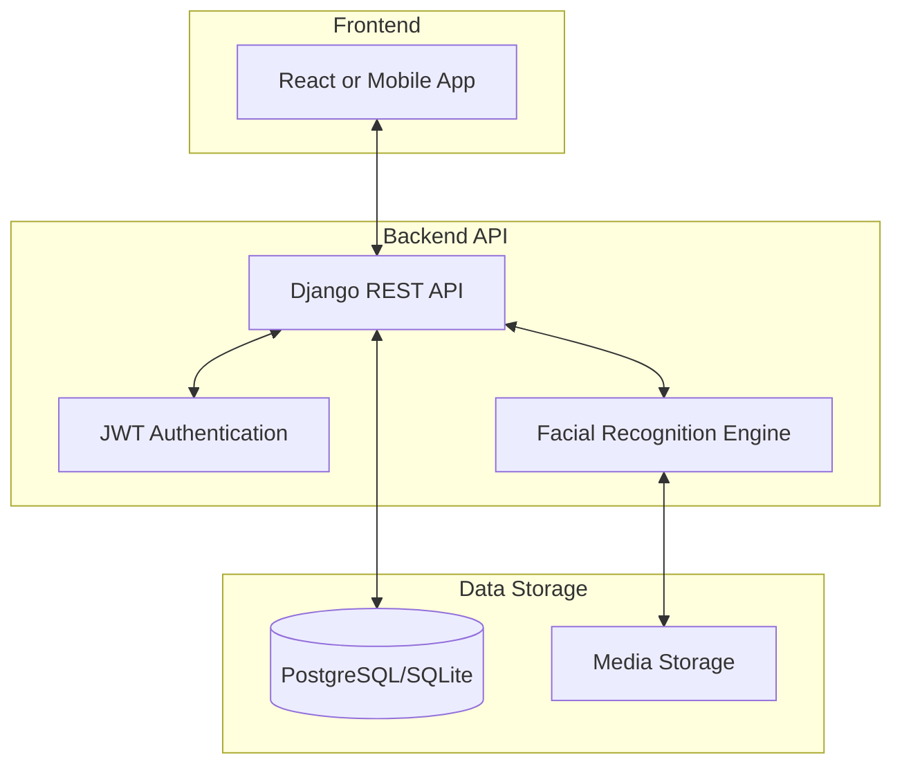
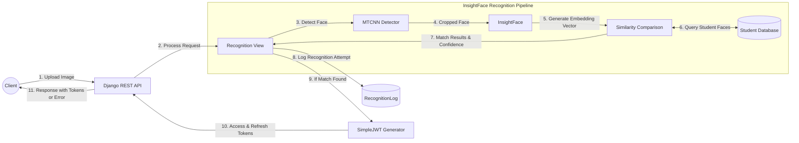
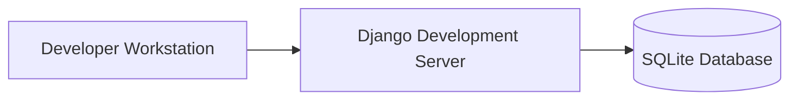
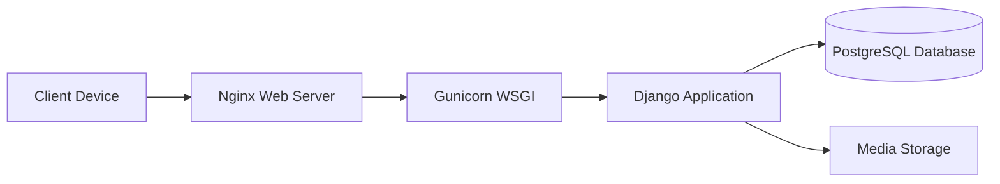

# Yabatech Facial Recognition System Architecture Overview

This document provides a high-level overview of the Yabatech Facial Recognition System architecture, including system components, technology stack, and key design decisions.

## System Architecture

## Backend Architecture Flow

## Component Breakdown

### Frontend

* **Nextjs/Mobile App**: User interface for students and administrators
* **JWT Integration**: Authentication token handling
* **Webcam/Camera Access**: For facial recognition capture
* **Form Components**: For user registration and management

### Backend

* **Django REST Framework**: Core API framework
* **Simple JWT**: JWT token authentication system
* **InsightFace**: Deep learning facial recognition technology
* **OpenCV**: Computer vision library for image processing
* **SQLite/PostgreSQL**: Primary database

### Facial Recognition Engine

* **InsightFace**: Deep learning-based face recognition
* **MTCNN**: Multi-task Cascaded Convolutional Networks for face detection
* **OnnxRuntime**: High-performance inference engine
* **NumPy**: For efficient numerical operations

## Technology Stack

### Backend

| Technology | Version | Purpose |
|------------|---------|---------|
| Python | 3.11+ | Programming language |
| Django | Latest | Web framework |
| Django REST Framework | Latest | API framework |
| Django Simple JWT | Latest | Authentication |
| InsightFace | Latest | Facial recognition |
| OpenCV | Latest | Image processing |
| MTCNN | Latest | Face detection |
| SQLite/PostgreSQL | Latest | Database |

### DevOps

| Technology | Purpose |
|------------|---------|
| GitHub | Version control |
| Docker (optional) | Containerization |
| Nginx (production) | Web server |
| Gunicorn (production) | WSGI server |

## Key Design Decisions

### Facial Recognition Architecture

The system implements a multi-stage facial recognition pipeline:

1. **Face Detection**: Using MTCNN to detect and crop faces from images
2. **Feature Extraction**: Using InsightFace to generate face embeddings
3. **Similarity Matching**: Comparing embeddings against stored templates
4. **Confidence Scoring**: Determining match probability with a configurable threshold

### Authentication System

JWT (JSON Web Token) authentication was selected for:

* **Stateless Authentication**: No need to store session data
* **Mobile Friendliness**: Works well with mobile clients
* **Performance**: Minimal database queries for authentication
* **Refresh Mechanism**: Support for token refresh without re-login

### Database Schema Design

The database design follows these principles:

1. **Separation of User and Profile**: Clean separation between authentication and profile data
2. **UUID Primary Keys**: For improved security and distribution
3. **Audit Trails**: Tracking of all recognition attempts
4. **Image Storage**: Efficient storage of face images for verification and audit

### API Design Principles

1. **RESTful Structure**
   * Resources are represented as URLs
   * HTTP methods match CRUD operations
   * Proper status codes for responses
   * Consistent error formats

2. **Authentication & Authorization**
   * JWT for authentication
   * Permission-based access control
   * Token refresh mechanism
   * Secure endpoints with proper permissions

3. **Swagger/OpenAPI Documentation**
   * Interactive API documentation
   * Request/response schema documentation
   * Authentication flow documentation

## Scalability Considerations

### Current Architecture Capacity

* Supports hundreds of concurrent users
* Handles thousands of recognition attempts per day
* Response time < 1s for recognition operations

### Future Scaling Strategies

1. **Database Scaling**
   * Migration to PostgreSQL for larger deployments
   * Database connection pooling
   * Read replicas for reporting queries

2. **API Scaling**
   * Horizontal scaling with multiple API instances
   * Load balancing across instances
   * Caching frequently accessed data

3. **Face Recognition Optimizations**
   * GPU acceleration for face recognition
   * Optimized model selection
   * Batch processing for enrollment

## Security Measures

1. **Authentication Security**
   * Short-lived access tokens (15 minutes)
   * Refresh token mechanism
   * Role-based access control
   * HTTPS for all communications

2. **Data Protection**
   * Face image encryption in transit
   * Secure media storage
   * Input validation and sanitization
   * Protection against common attacks (CSRF, XSS)

3. **Facial Recognition Security**
   * Liveness detection (future implementation)
   * Confidence thresholds to prevent false positives
   * Audit logging of all recognition attempts
   * Face image storage security

## Deployment Architecture

### Development Environment

### Production Environment

## Future Enhancements

1. **Advanced Liveness Detection**: To prevent spoofing attacks
2. **Multi-Factor Authentication**: Additional security layers
3. **Batch Student Enrollment**: Efficient onboarding process
4. **Performance Optimizations**: GPU support for faster recognition
5. **Mobile Application**: Dedicated mobile app for students
6. **Offline Mode**: Support for offline recognition in limited connectivity environments 